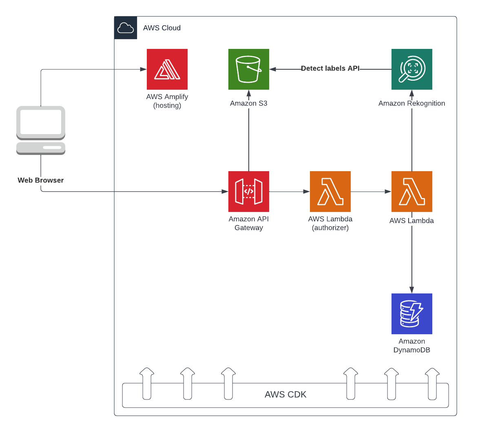

# Serverless AI/ML Todo App

In this tutorial, you'll create a simple serverless web application using the AWS CDK and that implements a "Todo app"
with an API to store and retrieve tasks in a cloud database. In addition, we will integrate machine learning to
automatically identify and label objects in images attached to tasks.

## Application Architecture

The application architecture uses AWS Lambda, Amazon API Gateway, Amazon DynamoDB, Amazon Simple Storage Service (S3),
and AWS Amplify Console.

Amplify Console provides continuous deployment and hosting of the static web resources
including HTML, CSS, JavaScript, and image files which are loaded in the user's browser. JavaScript executed in the
browser sends and receives data from a public backend API built using Lambda and API Gateway. DynamoDB provides a
persistence layer where data can be stored by the API's Lambda function. S3 is used to store uploaded images. Finally,
Amazon Rekognition is used to detect and label objects in those images.



### Modules
This workshop is divided into multiple steps. Each step describes a scenario of what we're going to build and step-by-step directions to help you implement the architecture and verify your work. The steps must be performed in order for the workshop to be successful.

- [Install prerequisites](#prerequisites)
- [Build a serverless backend](assets/serverless-backend.md)
- [Build and deploy the web application](webapp/README.md)
- [Configure Amazon Rekognition Integration](assets/rekognition.md)
- [Terminate Resources](assets/terminate-resources.md)

## Getting started

### Prerequisites

- AWS Experience: Beginner (Basic HTML/CSS/JavaScript and Linux command line knowledge is helpful)
- Tutorial Prerequisites: An AWS account, a text editor, recommended browser: latest version of Chrome or Firefox,
  Amazon S3, AWS Lambda, Amazon API Gateway, Amazon DynamoDB, Amazon Rekognition.

The following tools need to be installed on your system prior to installing the CDK:

- [Node.js >= 14.15.0](https://nodejs.org/download/release/latest-v14.x/)
    - We recommend using a version in [Active LTS](https://nodejs.org/en/about/releases/)
- [Yarn >= 1.19.1, < 2](https://yarnpkg.com/lang/en/docs/install)
- [Docker >= 19.03](https://docs.docker.com/get-docker/)
    - the Docker daemon must also be running
- [TypeScript >= 3.8](https://www.npmjs.com/package/typescript)

Install TypeScript.

```
$ npm install -g typescript
```

Install the AWS CDK.

```
$ npm install -g aws-cdk 
```

Init a new project (This command has already been executed to create the current resources within the repository).

```
mkdir my-project
cd my-project
cdk init app --language typescript
```

